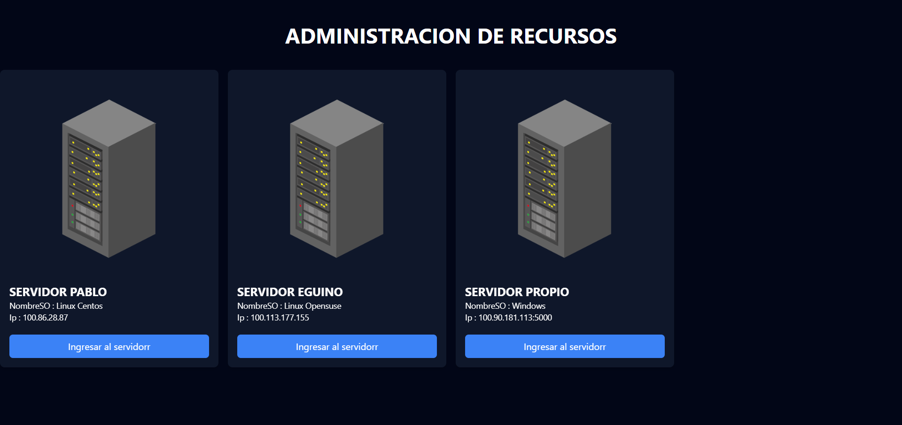
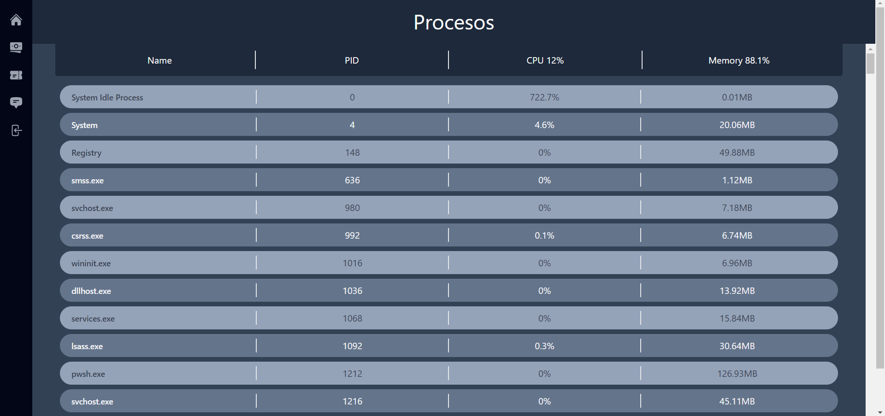
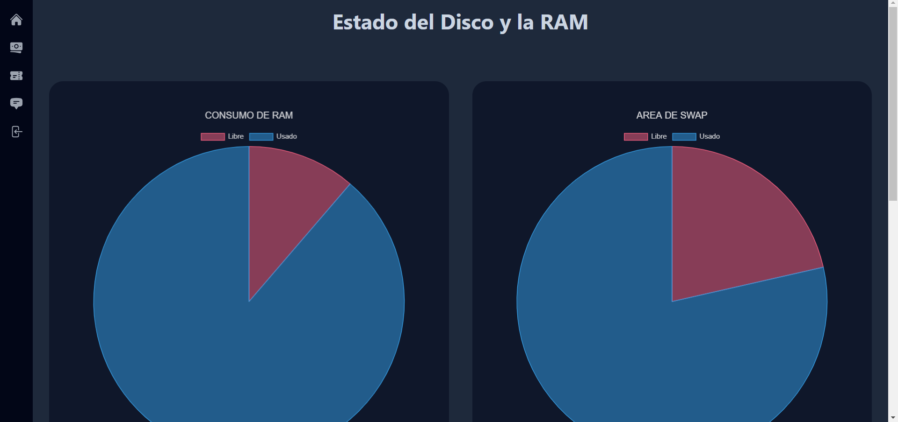
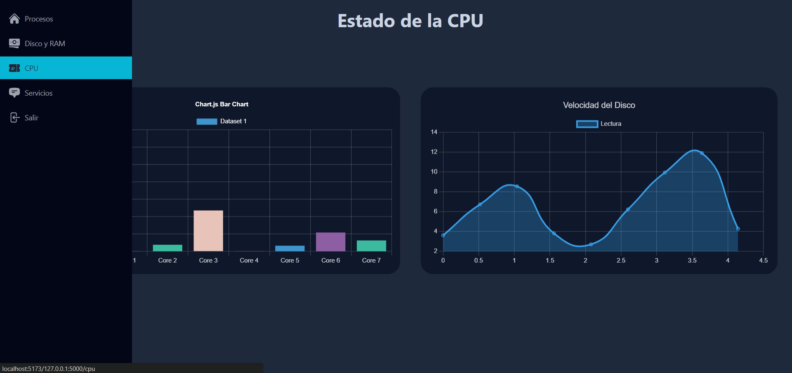
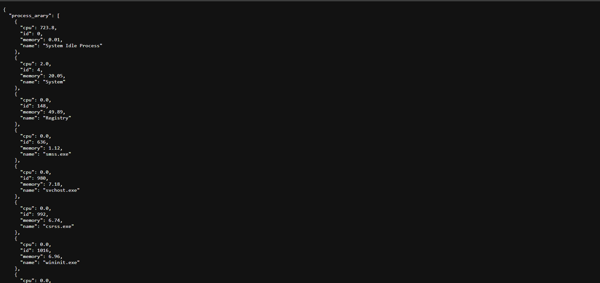

# Monitoreo - De - Sistemas - Operativos

## Descripción
Sistema Web que es capaz de monitorear distintos sistemas operativos, abarca desde la inspeccion de los prosesos o programas en ejecucion hasta la lectura de del estado del CPU, RAM y Discos.

Desarrollado con ReactJS para el Frontend y Flask para el Backend.

## Características
- Monitoreo de sistemas operativos.
- Sistema Web.
- API en Flask.

## Instrucciones de Uso
### Frontend (React)

1. Abra la terminal y navegue a la carpeta del Frontend: `cd frontend`.
2. Instale las dependencias utilizando el comando: `npm install`.

### Backend (Flask)

1. Abra otra terminal y navegue a la carpeta del Backend: `cd backend`.
2. Instale las librerías necesarias.

### Ejecución

1. En la terminal del Frontend, ejecute el proyecto React con el comando: `npm run dev`.
2. En la terminal del Backend, inicie el servidor Flask con: `python main.py`.

## Dependencias
Las dependecias estan en el mismo repositorio.

## Imagenes

    
    

    
    

## Licencia
Este proyecto está bajo la Licencia MIT. Consulta el archivo [LICENSE](LICENSE) para obtener más detalles.

---